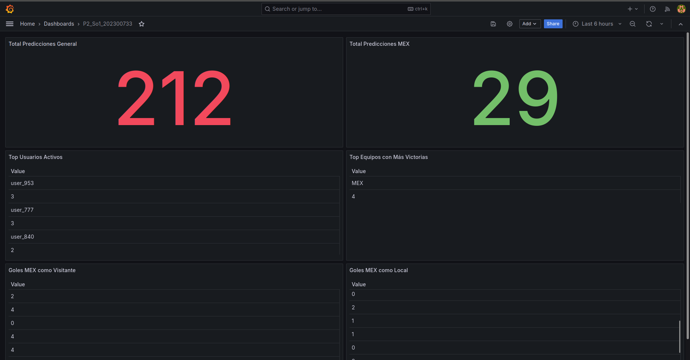
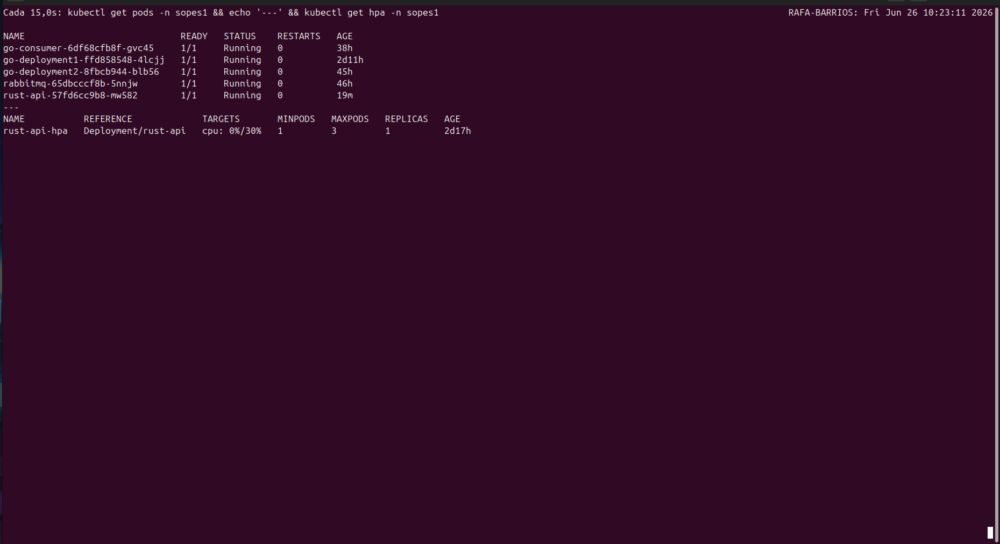
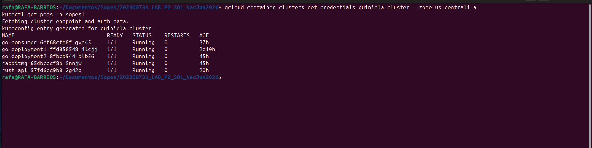
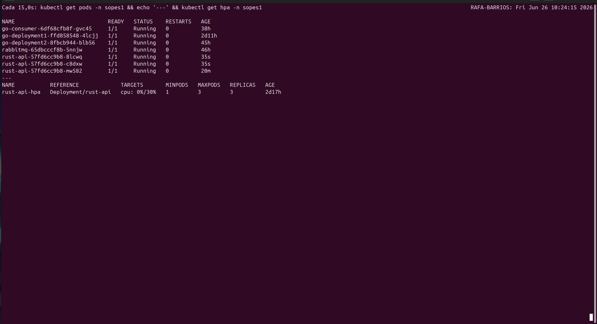
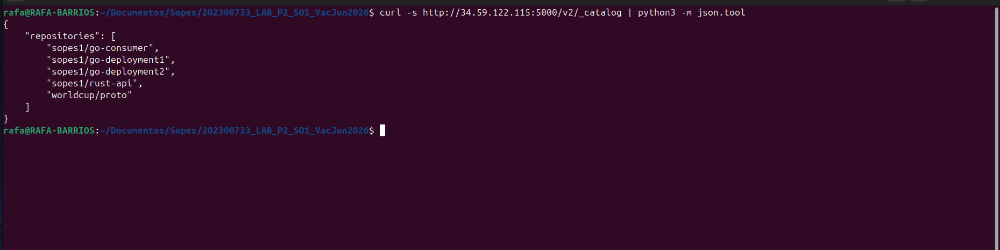

# Manual Técnico
## Proyecto 2: Plataforma Distribuida de Quiniela Mundial 2026 en GKE

---

Universidad San Carlos de Guatemala

Angel Rafael Barrios González

202300733

Sección B

Lab Sistemas Operativos 1

25/06/2026

---

## 1. Descripción General del Sistema

Este proyecto implementa una plataforma distribuida en Google Cloud Platform (GCP) para procesar predicciones de partidos del Mundial 2026 en tiempo real. El sistema recibe predicciones de usuarios a través de un generador de tráfico (Locust), las procesa a través de una cadena de microservicios, y las visualiza en un dashboard de Grafana.

### Arquitectura general

```
┌─────────────────────────────────────────────────────────────────────┐
│                         GOOGLE CLOUD PLATFORM                        │
│                                                                       │
│   ┌──────────┐      ┌──────────────────────────────────────────┐    │
│   │ VM Zot   │      │           CLÚSTER GKE                     │    │
│   │ Registry │◄─────│  ┌─────────┐  ┌─────────┐  ┌─────────┐  │    │
│   │:5000     │      │  │Rust API │  │Go Deploy│  │Go Deploy│  │    │
│   └──────────┘      │  │REST+HPA │─►│    1    │─►│    2    │  │    │
│                      │  └─────────┘  └─────────┘  └─────────┘  │    │
│   ┌──────────┐      │       ▲              │gRPC        │        │    │
│   │ VM       │      │       │              ▼            ▼        │    │
│   │ Valkey   │◄─────│  Gateway API   RabbitMQ    Consumer Go    │    │
│   │:6379     │      │                                            │    │
│   └──────────┘      └──────────────────────────────────────────┘    │
│                                                                       │
│   ┌──────────┐                                                        │
│   │ VM       │                                                        │
│   │ Grafana  │                                                        │
│   │:3000     │                                                        │
│   └──────────┘                                                        │
└─────────────────────────────────────────────────────────────────────┘

LOCUST ──► Gateway API ──► Rust API ──► Go D1 ──► Go D2 ──► RabbitMQ ──► Consumer ──► Valkey ──► Grafana
```

---

## 2. Estructura del Repositorio

```
202300733_LAB_P2_SO1_VacJun2026/
├── rust-api/
│   ├── src/
│   │   └── main.rs                  # API REST en Rust
│   ├── Cargo.toml                   # Dependencias de Rust
│   └── Dockerfile                   # Imagen Docker de Rust
├── go-deployment1/
│   ├── proto/
│   │   ├── worldcup.pb.go           # Código generado del .proto
│   │   └── worldcup_grpc.pb.go      # Código gRPC generado
│   ├── src/
│   │   ├── main.go                  # Servidor HTTP + gRPC Client
│   │   └── client/
│   │       └── grpc_client.go       # Cliente gRPC hacia Deployment 2
│   ├── go.mod
│   └── Dockerfile
├── go-deployment2/
│   ├── proto/
│   │   ├── worldcup.pb.go
│   │   └── worldcup_grpc.pb.go
│   ├── src/
│   │   ├── main.go                  # gRPC Server + RabbitMQ Writer
│   │   └── rabbitmq/
│   │       └── writer.go            # Publicador de mensajes en RabbitMQ
│   ├── go.mod
│   └── Dockerfile
├── go-consumer/
│   ├── src/
│   │   └── main.go                  # Consumer de RabbitMQ → Valkey
│   ├── go.mod
│   └── Dockerfile
├── locust/
│   └── locustfile.py                # Script de pruebas de carga
├── k8s/
│   ├── gateway/
│   │   ├── gateway.yaml             # GatewayClass y Gateway
│   │   └── httproute.yaml           # Ruta /grpc-202300733
│   ├── rust-api/
│   │   ├── deployment.yaml
│   │   ├── service.yaml
│   │   └── hpa.yaml                 # HPA: 1-3 réplicas, CPU > 30%
│   ├── go-deployment1/
│   │   ├── deployment.yaml
│   │   └── service.yaml
│   ├── go-deployment2/
│   │   ├── deployment.yaml
│   │   └── service.yaml
│   ├── rabbitmq/
│   │   ├── deployment.yaml
│   │   └── service.yaml
│   ├── consumer/
│   │   └── deployment.yaml
│   └── kubevirt/
│       └── services.yaml            # Services apuntando a VMs externas
├── worldcup.proto                   # Contrato gRPC (también en Zot como OCI Artifact)
└── docs/
    ├── infrastructure.md            # Datos de infraestructura GCP
    ├── resultados-pruebas.md        # Resultados de pruebas de carga
    ├── grafana-dashboard-mex.json   # Export del dashboard de Grafana
    ├── manual_tecnico.md
    └── manual_usuario.md
```

---

## 3. Infraestructura en GCP

### 3.1 Proyecto GCP

| Parámetro | Valor |
|---|---|
| Project ID | so1-lab-p2-202300733 |
| Region | us-central1 |
| Zone | us-central1-a |

### 3.2 Clúster GKE

| Parámetro | Valor |
|---|---|
| Nombre | quiniela-cluster |
| Machine type | n1-standard-4 |
| Nodos | 3 (autoscaling 1-5) |
| Disco | pd-standard 50GB por nodo |
| Namespace | sopes1 |
| Virtualización anidada | Habilitada |

```bash
gcloud container clusters create quiniela-cluster \
  --zone us-central1-a \
  --machine-type n1-standard-4 \
  --num-nodes 3 \
  --image-type UBUNTU_CONTAINERD \
  --metadata enable-nested-virtualization=true \
  --disk-type pd-standard \
  --disk-size 50GB
```

### 3.3 VMs en GCP

| VM | Propósito | IP Externa | IP Interna | Machine Type |
|---|---|---|---|---|
| zot-registry | Registry privado de imágenes | 34.59.122.115 | 10.128.0.17 | e2-medium |
| vm-valkey | Base de datos Valkey | 34.27.42.88 | 10.128.0.18 | e2-small |
| vm-grafana | Visualización Grafana | 136.112.209.40 | 10.128.0.19 | e2-medium |

---

## 4. Zot Container Registry

### 4.1 Descripción

Zot es el registry privado OCI donde se almacenan todas las imágenes Docker del proyecto. Corre en una VM de GCP completamente separada del clúster GKE.

### 4.2 Configuración

```json
{
  "distSpecVersion": "1.1.0",
  "storage": {
    "rootDirectory": "/var/lib/zot/data"
  },
  "http": {
    "address": "0.0.0.0",
    "port": "5000"
  },
  "log": {
    "level": "info"
  }
}
```

### 4.3 OCI Artifact — worldcup.proto

El archivo `worldcup.proto` fue subido a Zot como OCI Artifact. Este archivo define el contrato gRPC entre Go Deployment 1 (gRPC Client) y Go Deployment 2 (gRPC Server). Todos los servicios Go que participan en la comunicación gRPC descargan este artifact durante el proceso de build.

```bash
# Subida del artifact
oras push --insecure \
  34.59.122.115:5000/worldcup/proto:v1.0 \
  worldcup.proto:application/vnd.worldcup.proto

# Referencia del artifact
34.59.122.115:5000/worldcup/proto:v1.0
```

### 4.4 Imágenes almacenadas

| Imagen | Tag | Servicio |
|---|---|---|
| sopes1/rust-api | v1.0 | API REST en Rust |
| sopes1/go-deployment1 | v1.0 | gRPC Client en Go |
| sopes1/go-deployment2 | v1.0 | gRPC Server + RabbitMQ Writer |
| sopes1/go-consumer | v1.0 | Consumer RabbitMQ → Valkey |
| worldcup/proto | v1.0 | OCI Artifact del .proto |

---

## 5. API REST en Rust (rust-api)

### 5.1 Descripción

La API REST en Rust es el punto de entrada del sistema. Recibe predicciones de partidos de Locust vía Gateway API y las reenvía al Go Deployment 1.

### 5.2 Tecnologías

| Dependencia | Versión | Uso |
|---|---|---|
| actix-web | 4 | Framework HTTP |
| serde / serde_json | 1 | Serialización JSON |
| tokio | 1 | Runtime asíncrono |
| reqwest | 0.12 | Cliente HTTP para llamar a Go D1 |

### 5.3 Endpoint

| Método | Ruta | Descripción |
|---|---|---|
| POST | /predict | Recibe predicción de Locust |
| GET | /health | Health check para probes de K8s |

### 5.4 Estructura JSON recibida

```json
{
  "home_team": "MEX",
  "away_team": "GTM",
  "home_goals": 2,
  "away_goals": 1,
  "username": "user_42",
  "timestamp": "2026-06-25T18:00:00Z"
}
```

### 5.5 HPA (Horizontal Pod Autoscaler)

| Parámetro | Valor |
|---|---|
| Réplicas mínimas | 1 |
| Réplicas máximas | 3 |
| Métrica | CPU |
| Umbral de escalado | 30% |

```yaml
metrics:
- type: Resource
  resource:
    name: cpu
    target:
      type: Utilization
      averageUtilization: 30
```

---

## 6. Go Deployment 1 (gRPC Client)

### 6.1 Descripción

Go Deployment 1 actúa como puente entre la API REST en Rust y el gRPC Server. Expone un endpoint HTTP interno que recibe predicciones de Rust y las reenvía al Go Deployment 2 mediante gRPC.

### 6.2 Tecnologías

| Dependencia | Versión | Uso |
|---|---|---|
| gin-gonic/gin | 1.12 | Framework HTTP |
| google.golang.org/grpc | 1.81.1 | Comunicación gRPC |
| google.golang.org/protobuf | 1.36.11 | Serialización Protocol Buffers |

### 6.3 Flujo interno

```
Rust API ──HTTP POST /predict──► Gin Handler
                                      │
                                      ▼
                               GRPCClient.SendPrediction()
                                      │
                                      ▼
                          go-deployment2-service:50051
```

---

## 7. Go Deployment 2 (gRPC Server + RabbitMQ Writer)

### 7.1 Descripción

Go Deployment 2 implementa el servidor gRPC que recibe las predicciones del Deployment 1 y las publica en la cola de RabbitMQ.

### 7.2 Tecnologías

| Dependencia | Versión | Uso |
|---|---|---|
| google.golang.org/grpc | 1.81.1 | Servidor gRPC |
| rabbitmq/amqp091-go | 1.12.0 | Publicador de mensajes AMQP |

### 7.3 Cola RabbitMQ

| Parámetro | Valor |
|---|---|
| Nombre de la cola | predictions |
| Durable | true |
| Auto-delete | false |
| Content-Type | application/json |
| DeliveryMode | Persistent |

---

## 8. Contrato gRPC (worldcup.proto)

```protobuf
syntax = "proto3";

package worldcup;

option go_package = "./worldcup";

service PredictionService {
  rpc SendPrediction (PredictionRequest) returns (PredictionResponse);
}

message PredictionRequest {
  string home_team = 1;
  string away_team = 2;
  int32  home_goals = 3;
  int32  away_goals = 4;
  string username   = 5;
  string timestamp  = 6;
}

message PredictionResponse {
  bool   success = 1;
  string message = 2;
}
```

---

## 9. RabbitMQ

### 9.1 Descripción

RabbitMQ es el broker de mensajería que desacopla la escritura (Go Deployment 2) del procesamiento (Consumer). Corre como Deployment dentro del clúster GKE.

### 9.2 Imagen utilizada

```
rabbitmq:3.13-management-alpine
```

### 9.3 Credenciales

| Usuario | Contraseña |
|---|---|
| admin | admin123 |

### 9.4 Puertos

| Puerto | Uso |
|---|---|
| 5672 | AMQP (mensajería) |
| 15672 | Management UI |

---

## 10. Consumer Go (RabbitMQ → Valkey)

### 10.1 Descripción

El Consumer lee mensajes de la cola `predictions` de RabbitMQ y los almacena en Valkey con diferentes estructuras de datos según el tipo de información.

### 10.2 Tecnologías

| Dependencia | Versión | Uso |
|---|---|---|
| rabbitmq/amqp091-go | 1.12.0 | Consumidor de mensajes |
| valkey-io/valkey-go | 1.0.76 | Cliente Valkey |

### 10.3 Estructura de keys en Valkey

| Key | Tipo | Contenido |
|---|---|---|
| `total:predictions` | String | Contador total de predicciones |
| `mex:total` | String | Total de predicciones con MEX |
| `mex:home_goals` | List | Goles de MEX como local |
| `mex:away_goals` | List | Goles de MEX como visitante |
| `mex:timeline` | Sorted Set | Serie temporal de predicciones de MEX |
| `users:activity` | Sorted Set | Actividad por usuario (score = predicciones) |
| `teams:wins` | Sorted Set | Victorias por equipo |
| `mex:home:wins:MEX` | String | Victorias de MEX como local |

---

## 11. Kubernetes Gateway API

### 11.1 Descripción

El Gateway API es el componente que recibe el tráfico externo de Locust y lo enruta hacia la API REST en Rust. Reemplaza el Ingress Controller tradicional.

### 11.2 Ruta configurada

| Parámetro | Valor |
|---|---|
| Ruta | /grpc-202300733 |
| Backend | rust-api-service:8080 |
| Protocolo | HTTP |

### 11.3 Configuración

```yaml
apiVersion: gateway.networking.k8s.io/v1
kind: HTTPRoute
metadata:
  name: rust-api-route
  namespace: sopes1
spec:
  rules:
  - matches:
    - path:
        type: PathPrefix
        value: /grpc-202300733
    backendRefs:
    - name: rust-api-service
      port: 8080
```

---

## 12. Valkey en VM de GCP

### 12.1 Descripción

Valkey es una base de datos key-value compatible con Redis. Corre como contenedor Docker dentro de la VM `vm-valkey` en GCP.

### 12.2 Instalación en la VM

```bash
sudo apt install -y docker.io
sudo systemctl start docker
sudo docker run -d --name valkey --network host valkey/valkey:8-alpine
```

### 12.3 Acceso desde el clúster

Se creó un Service de tipo ClusterIP con un Endpoint manual apuntando a la IP interna de la VM:

```yaml
apiVersion: v1
kind: Endpoints
metadata:
  name: valkey-service
  namespace: sopes1
subsets:
- addresses:
  - ip: 10.128.0.18
  ports:
  - port: 6379
```

---

## 13. Grafana en VM de GCP

### 13.1 Descripción

Grafana corre como contenedor Docker dentro de la VM `vm-grafana` en GCP. Se conecta a Valkey como datasource para visualizar las predicciones del equipo MEX.

### 13.2 Instalación en la VM

```bash
sudo apt install -y docker.io
sudo systemctl start docker
sudo docker run -d --name grafana --network host grafana/grafana:11.0.0
sudo docker exec grafana grafana-cli plugins install redis-datasource
sudo docker restart grafana
```

### 13.3 Datasource configurado

| Parámetro | Valor |
|---|---|
| Tipo | Redis (redis-datasource) |
| Address | 10.128.0.18:6379 |

### 13.4 Paneles del dashboard MEX

| Panel | Tipo | Command | Descripción |
|---|---|---|---|
| Total Predicciones MEX | Stat | GET mex:total | Total de veces que MEX apareció |
| Total Predicciones General | Stat | GET total:predictions | Total de predicciones en el sistema |
| Top Usuarios Activos | Table | ZREVRANGE users:activity 0 9 WITHSCORES | Top 10 usuarios más activos |
| Top Equipos con Más Victorias | Table | ZREVRANGE teams:wins 0 9 WITHSCORES | Ranking de victorias por equipo |
| Goles MEX como Local | Table | LRANGE mex:home_goals 0 -1 | Lista de goles predichos como local |
| Goles MEX como Visitante | Table | LRANGE mex:away_goals 0 -1 | Lista de goles predichos como visitante |



---

## 14. Locust — Pruebas de Carga

### 14.1 Descripción

Locust genera tráfico simulando usuarios que envían predicciones de partidos al sistema.

### 14.2 Estructura del payload

```python
payload = {
    "home_team": random.choice(TEAMS),
    "away_team": random.choice(TEAMS),
    "home_goals": random.randint(0, 5),
    "away_goals": random.randint(0, 5),
    "username": f"user_{random.randint(1, 1000)}",
    "timestamp": datetime.now(timezone.utc).strftime("%Y-%m-%dT%H:%M:%SZ")
}
```

### 14.3 Comando de ejecución

```bash
locust -f locust/locustfile.py \
  --host=http://localhost:8080 \
  --users 50 \
  --spawn-rate 10 \
  --run-time 120s \
  --headless
```

---

## 15. Resultados de Pruebas de Carga

### 15.1 Prueba 1 — Consumer con 1 réplica

| Métrica | Valor |
|---|---|
| Total requests | 2216 |
| Requests/segundo | 18.49 |
| Tiempo promedio | 680ms |
| Réplicas Rust (HPA) | 3 (escaló automáticamente) |

### 15.2 Prueba 2 — Consumer con 2 réplicas

| Métrica | Valor |
|---|---|
| Total requests | 2960 |
| Requests/segundo | 24.72 |
| Tiempo promedio | 2ms |
| Réplicas Rust (HPA) | 1 |

### 15.3 Comportamiento del HPA

Durante la Prueba 1, el HPA de Rust detectó que la CPU superó el umbral del 30% y escaló automáticamente de 1 a 3 réplicas. Con 2 réplicas del Consumer, la carga se distribuyó más eficientemente y el HPA no necesitó escalar.



---

## 16. Problemas encontrados y soluciones

### Problema: Cuota de SSD excedida al crear el clúster GKE

**Causa:** Los nodos N1 usan SSD por defecto y la cuenta tenía límite de 250GB en us-central1.

**Solución:** Se agregó `--disk-type pd-standard --disk-size 50GB` al comando de creación del clúster para usar disco HDD estándar.

### Problema: Nodos GKE no podían descargar imágenes de Zot con HTTPS

**Causa:** El certificado autofirmado de Zot no incluía la IP como SAN (Subject Alternative Name), lo que causaba error `x509: cannot validate certificate`.

**Solución:** Se regeneró el certificado con un archivo de configuración OpenSSL que incluye `subjectAltName = IP:34.59.122.115`. Posteriormente se migró Zot a HTTP para simplificar la configuración de containerd en los nodos.

### Problema: Bitnami RabbitMQ con ImagePullBackOff

**Causa:** Bitnami dejó de ofrecer imágenes gratuitas desde agosto 2025.

**Solución:** Se reemplazó el chart de Helm de Bitnami por un Deployment con la imagen oficial `rabbitmq:3.13-management-alpine` de Docker Hub.

### Problema: KubeVirt en estado Deploying indefinidamente

**Causa:** Los jobs de inicialización de KubeVirt tenían node affinity hacia nodos de control plane que no existen en GKE estándar. Los pods quedaban en Pending indefinidamente.

**Solución:** Se abandonó KubeVirt y se crearon VMs de GCP independientes (`vm-valkey` y `vm-grafana`) con Docker instalado para correr los contenedores. Esto cumple el objetivo del enunciado de tener contenedores gestionados por containerd/Docker dentro de VMs.

### Problema: go.mod requería Go 1.25 pero el Dockerfile usaba Go 1.22

**Causa:** La dependencia `google.golang.org/grpc v1.81.1` requería Go 1.25, y al ejecutar `go get`, el módulo se actualizó automáticamente.

**Solución:** Se actualizó el Dockerfile de los servicios Go de `golang:1.22-alpine` a `golang:1.25-alpine`.

---

## 17. Evidencia de Funcionamiento







